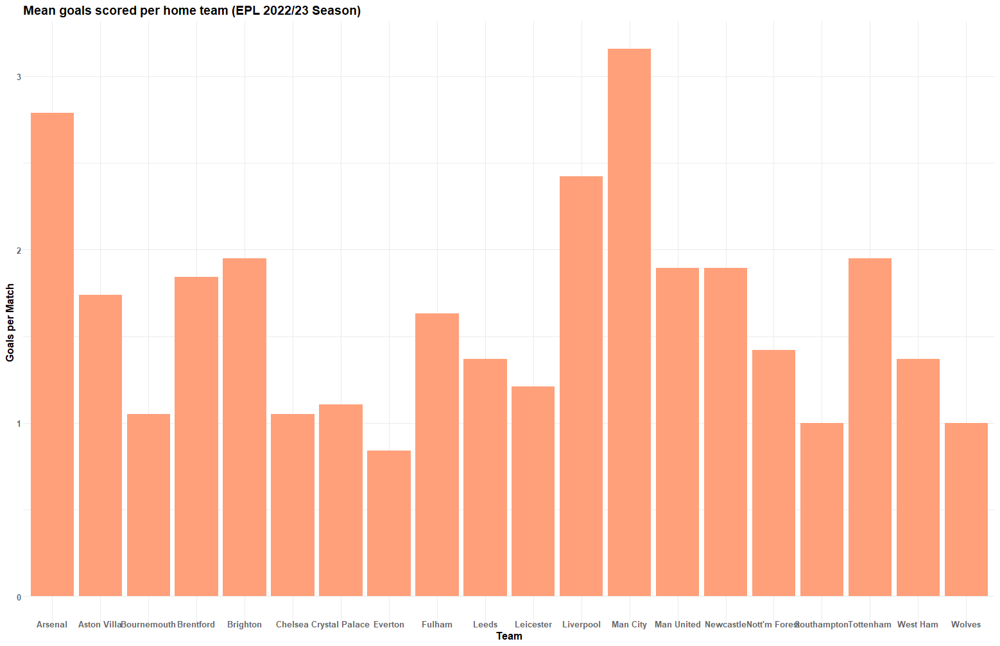
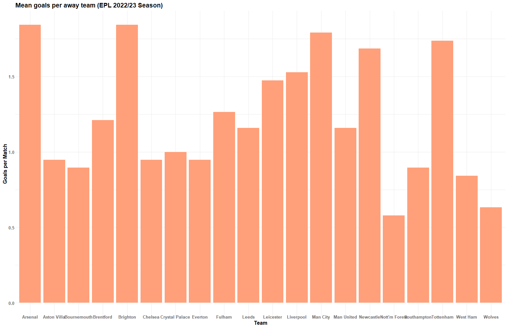
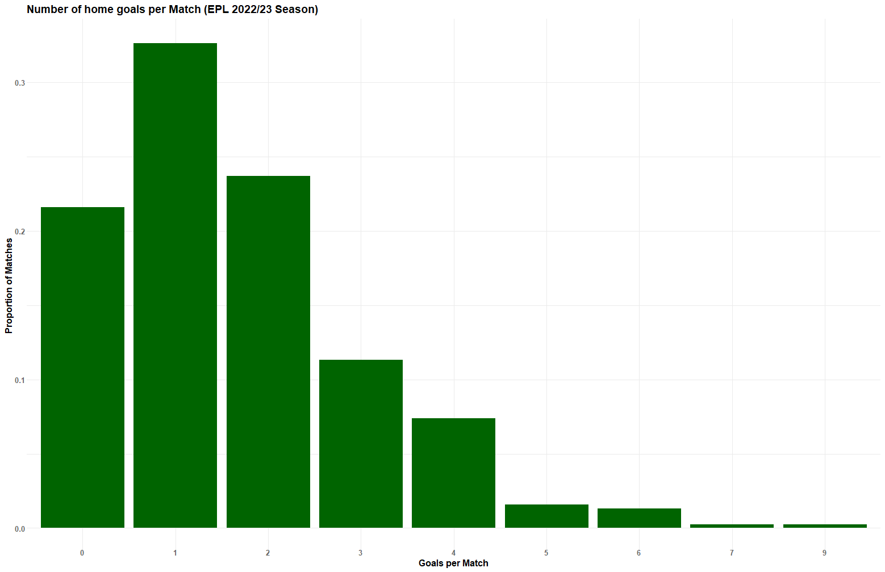
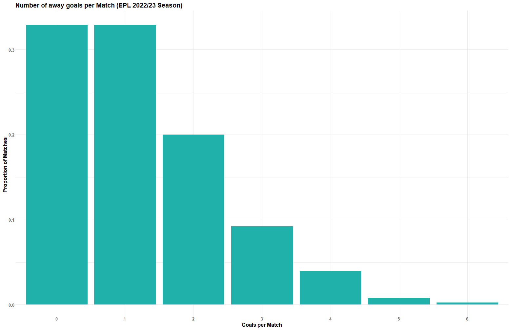
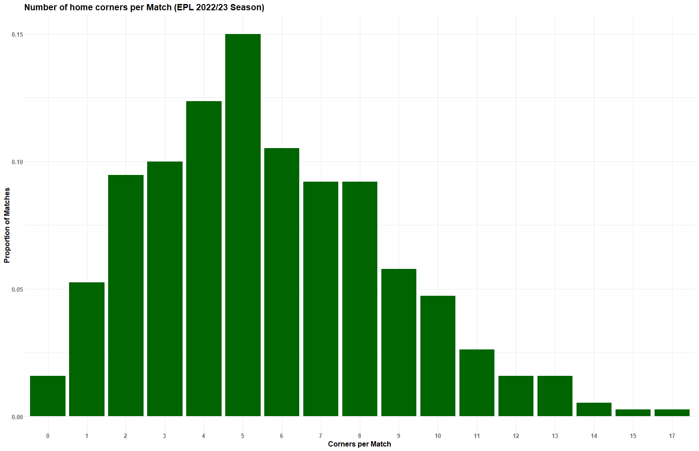
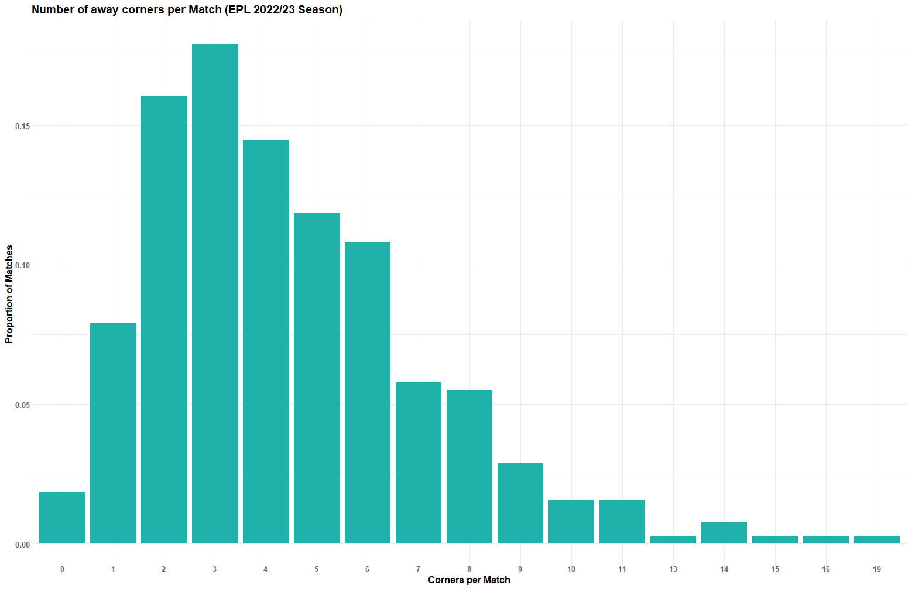

# Predicting soccer outcomes with R

This repo aims to provide practical examples of how some statistical models can be applied to predicting soccer outcomes. That being stated, this repo does not contain formal proof or evidence of why the models can be implemented or if they could be accurate at predicting said soccer outcomes.

## Data sources

The datasets were obtained from the following links:

PL-2022-23: https://www.football-data.co.uk/englandm.php

Notes for Football Data: https://www.football-data.co.uk/notes.txt

final_dataset_with_odds: https://www.kaggle.com/datasets/louischen7/football-results-and-betting-odds-data-of-epl/?select=final_dataset_with_odds.csv

## Exploratory analysis

Before even thinking about adjusting any model, let's try to create some simple graphs to get familiar with the datasets. All code relevant to these graphs can be found in the `explanatory_analysis.R` file. The data considered for this section is from the 2022/23 season of the English Premier League.

### Goals analysis

Mean goals scored per home team:



Mean goals scored per away team:



Proportion of matches with different number of home goals:



Proportion of matches with different number of away goals:



### Corners analysis

Proportion of matches with different number of corners:



Proportion of matches with different number of corners:



## Models

### Logistic regression

For this model, we will consider the team that was playing, the opponent, and whether or not the team won. Details about the code can be found in the `logistic_regression.R` file.

Let's show the head of the data that was used to build the model:

```R
head(epl_data_result)
```

```
  team                opponent  home win
1 Crystal Palace       Arsenal    1   0
2         Fulham     Liverpool    1   0
3    Bournemouth   Aston Villa    1   1
4          Leeds        Wolves    1   1
5      Newcastle Nott'm Forest    1   1
6      Tottenham   Southampton    1   1
```

Fitting the model

```R
logistic_model <- glm(win ~ home + team + opponent,
                      family="binomial", data=epl_data_result)
```

We can make predictions about a match Everton vs Fulham:

```R
predict(logistic_model,
        data.frame(home="1", team="Everton",
                   opponent="Fulham"), type="response")
```

```
        1
0.3184912
```

In this case, we get the probability of Everton winning at home to Fulham.

### Poisson regression

For this model, we will consider the team that was playing, the opponent, and how many goals were scored. Details about the code can be found in the `poisson_regression.R` file.

Let's show the head of the data that was used to build the model:

```R
head(epl_data_goals)
```

```
            team      opponent goals home
1 Crystal Palace       Arsenal     0    1
2         Fulham     Liverpool     2    1
3    Bournemouth   Aston Villa     2    1
4          Leeds        Wolves     2    1
5      Newcastle Nott'm Forest     2    1
6      Tottenham   Southampton     4    1
```

Fitting the model

```R
poisson_model <- glm(goals ~ home + team + opponent,
                   family=poisson(link=log), data=epl_data_goals)
```

We can make predictions about a match Everton vs Fulham:

```R
predict(poisson_model,
        data.frame(home="1", team="Everton",
                   opponent="Fulham"), type="response")
```

```
       1
1.006994
```

In this case, we get the expected number of goals Everton will score playing at home vs Fulham.

The same analysis is carried out for the number of corners and can be checked in detail in the `poisson_regression.R` file.

### Random Forest

For this model, we will now consider the `final_dataset_with_odds.csv` file. Details about the code can be found in the `random_regression.R` file.

Let's show the head of the data that was used to build the model:

```R
head(final_data_reduced)
```

```
  id       home       away HM1 HM2 HM3 HM4 HM5 AM1 AM2 AM3 AM4 AM5 B365H B365D  B365A IWH IWD  IWA   LBH  LBD   LBA  WHH WHD   WHA FTR
1  0  Blackburn Sunderland   M   M   M   M   M   M   M   M   M   M 1.727  3.25  4.333 1.8 3.1  3.8 1.615 3.25  5.00 1.66 3.3  4.50   D
2  1   Charlton    Chelsea   M   M   M   M   M   M   M   M   M   M 2.800  3.25  2.200 2.9 3.0  2.2 2.800 3.20  2.20 2.75 3.1  2.30   L
3  2    Everton  Tottenham   M   M   M   M   M   M   M   M   M   M 2.250  3.25  2.750 2.3 3.0  2.7 2.250 3.20  2.75 2.30 3.1  2.75   D
4  3     Fulham     Bolton   M   M   M   M   M   M   M   M   M   M 1.727  3.25  4.333 1.8 3.1  3.8 1.833 3.20  3.75 1.72 3.2  4.33   W
5  4      Leeds   Man City   M   M   M   M   M   M   M   M   M   M 1.667  3.40  4.500 1.7 3.2  4.2 1.615 3.50  4.50 1.66 3.3  4.50   W
6  5 Man United  West Brom   M   M   M   M   M   M   M   M   M   M 1.200  5.00 12.000 1.2 5.0 10.0 1.200 5.00 11.00 1.20 5.0 11.00   W
```

After splitting the data into a train and test set. we can fit the model

```R
random_forest_model <- randomForest(FTR~., data=train, proximity=TRUE)
```

To visualize the performance of the model with the test set via a confusion matrix:

```R
test %>%
  mutate(pred = predict(random_forest_model, test)) %>%
  select(FTR, pred) %>%
  table()
```

```
   pred
FTR   L   W   D
  L 209 167  43
  W  99 566  38
  D  94 246  38
```
